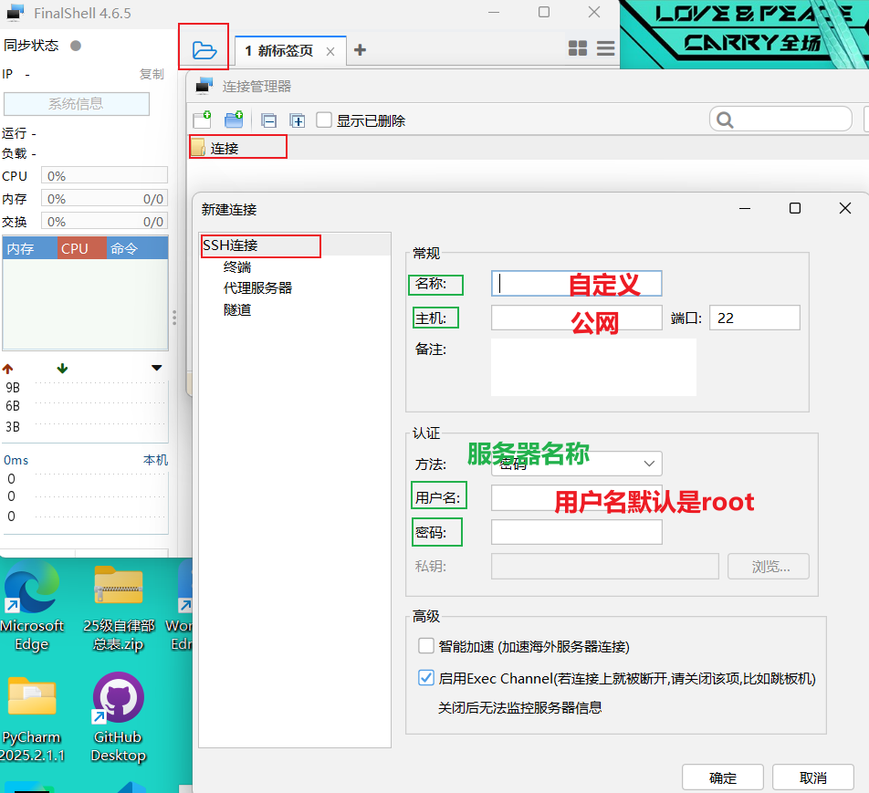
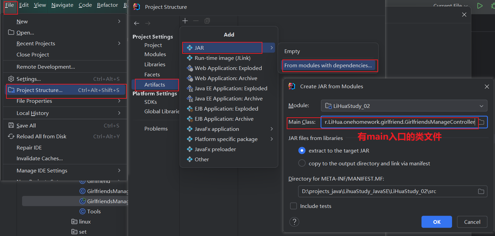
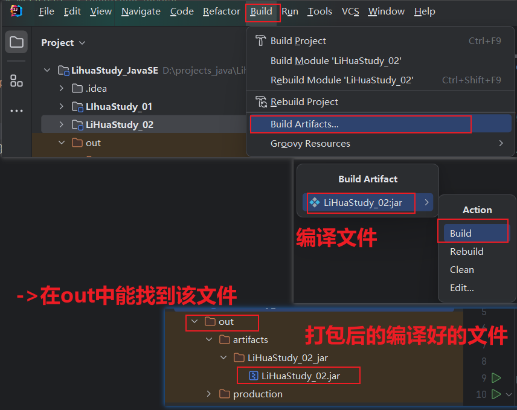
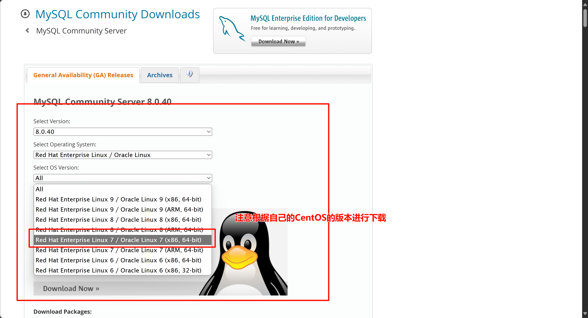
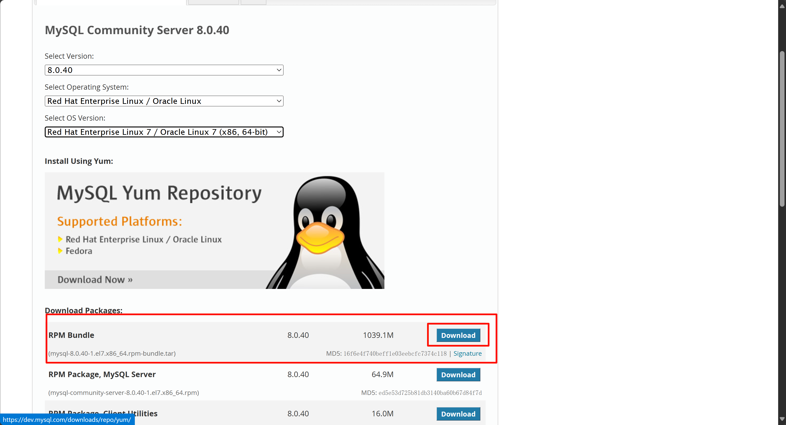
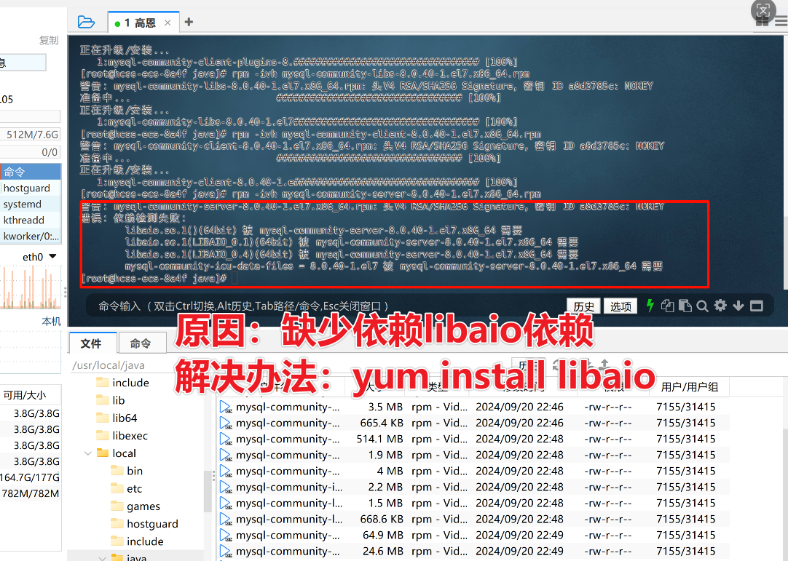
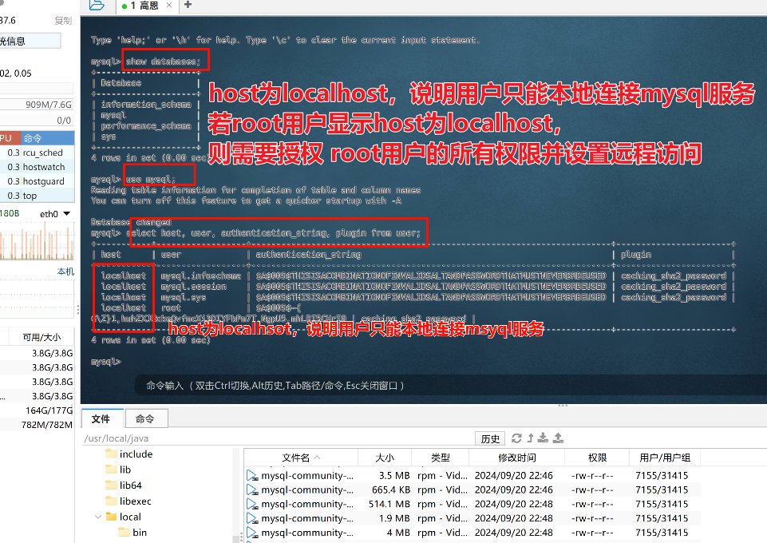
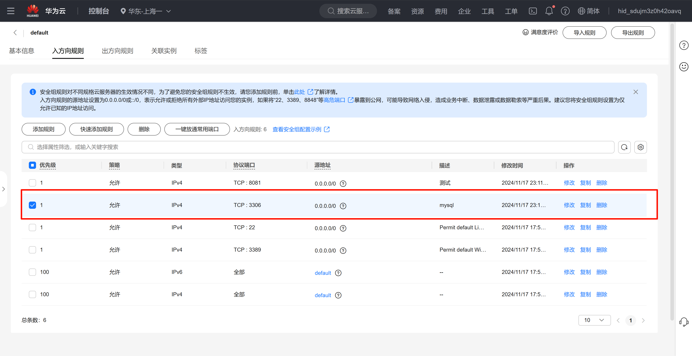

+++
date = '2025-12-19T12:13:38+08:00'
draft = false
weight = 101
title = '云_服务器'
description = '服务器可以理解成一台远程电脑，相较于你自己的电脑，他还承载了公网服务，他可以把程序文件放到公网上，所有人通过网址查询并进行访问，这就实现了程序只能在你的电脑上本地运行 -> 到所有人都能使用你的程序的这一步'
+++

## 何为“云”
-云 ，表示共享和远程，是把本地的文件、资源放到一个远程的资源库

## 云服务器的操作系统
远程的操作系统一般都适配的是“Linux操作系统”

***
## 购买并使用远程服务器
* *购买*
    1. 访问官网购买【服务器】
    2. 选择公共镜像<sup>厂家提供预制的标准化服务器模板</sup>，免去手动配置、初始化服务器  
        * 在这里选择的时候适配Linux操作系统的版本可以先选一个，后面会**重装**
    3. 配置服务器的密码    
    4. 支付后进入控制台    
    5. 重装<sup>先关闭服务器后才能操作</sup>
        * 在操作中 -> 云盘和镜像 -> 更换操作系统 -> 选择操作系统`cetnOS7.9`<sup>对Java最友好</sup> 
        * 重置密码
        * 对服务器的开、关机等操作都是在账号的控制台实现

* *本地操作远程服务器*
    1. 安装finalshell,是一个操作远程服务器的软件
        * 安装
        * 打开 -> 链接文件夹 -> SHH链接
           
        * 访问的三要素：  
            公网IP | 用户名 | 密码
    2. 弹出的控制窗口：
        * 提供 远程服务器的操作环境系统
        * 提供 远程服务器的文件系统        

* **服务器也近似一台电脑，重启解决90%的问题；联系客服解决剩下9%的问题；  
    重买解决100%的问题**

## 上传项目到远程服务器
* ### 在远程服务器上安装JDK
    1. 安装JDK包<sup>Linux版本的</sup>
    2. 上传JDK安装包
        * 系统的`/opt` 目录 -> 专门用来存放第三方工具  
        也可以自己定义路径  
    3. 解压： 找到当前目录  
        `tar -zxvf 压缩包的名称` -> 命令行实现解压，`tar`是Linux的压缩包后缀
    4. 配置环境变量
        * 系统的`/etc` 目录 -> 存放系统配置文件  
            `该目录下的profile文件` -> 配置环境变量
            ```java
                在`profile`文件末尾加入：
                # 这里需要注意的是第一个JAVA_HOME后面是你的安装路径（也就是解压路径）
                记得改成自己的
                export JAVA_HOME= jdk的安装路径
                export JRE_HOME=${JAVA_HOME}/jre
                export CLASSPATH=.:${JAVA_HOME}/lib:${JRE_HOME}/lib:$CLASSPATH
                export JAVA_PATH=${JAVA_HOME}/bin:${JRE_HOME}/bin
                export PATH=$PATH:${JAVA_PATH}

                #示例:
                export JAVA_HOME=/usr/local/java/jdk/jdk1.8.0_401
                export JRE_HOME=${JAVA_HOME}/jre
                export CLASSPATH=.:${JAVA_HOME}/lib:${JRE_HOME}/lib:$CLASSPATH
                export JAVA_PATH=${JAVA_HOME}/bin:${JRE_HOME}/bin
                export PATH=$PATH:${JAVA_PATH}
            ```         
        * `source /etc/profile` -> 让配置文件生效
    5. `java -version` -> 检查是否安装成功

* ### 打包项目到远程服务器
    1. 打包
        
        
        * 此时获得了【打包好的文件】,后缀是`.jar`
    2. 打包好的文件运行
        * 输入命令行：  
            `java -jar 打包的文件名` -> 在有jdk的操作系统上都能执行
                本机windows的`cmd` | 上传到`服务器`<sup>"上云"操作</sup>   
    * 这种打包方式是*本机打包* -> 无法通过公网访问


***
## 在远程服务器上创建数据库
* ### 在远程服务器上安装Mysql
    1. 安装Linux版本的mysql 
        * 查询服务器是x8664架构还是arm架构:  
            `uname -m`/`arch`
        * 根据架构安装mysql：
        
        
        * 成功拿到安装包
    2. 卸载服务器自带的环境mariadb<sup>mysql的开源分支</sup>    
        * 查看是否有MariaDB
        `rpm -qa | grep mariadb`
        * 卸载
        `rpm -e--nodeps 软件名`
        * `rpm -qa | grep mariadb` -> 查看是否卸载成功
    3. 上传mysql
    4. 解压压缩包
    5. 安装关键包
    ```
    #必须安装(注意顺序):
    rpm -ivh mysql-community-common-8.0.40-1.el7.x86_64.rpm
    rpm -ivh mysql-community-client-plugins-8.0.40-1.el7.x86_64.rpm 
    rpm -ivh mysql-community-libs-8.0.40-1.el7.x86_64.rpm
    rpm -ivh mysql-community-client-8.0.40-1.el7.x86_64.rpm
    rpm -ivh mysql-community-icu-data-files-8.0.40-1.el7.x86_64.rpm 
    rpm -ivh mysql-community-server-8.0.40-1.el7.x86_64.rpm
    #非必须安装的:
    rpm -ivh mysql-community-libs-compat-8.0.40-1.el7.x86_64.rpm
    rpm -ivh mysql-community-embedded-compat-8.0.40-1.el7 x86_64.rpm
    rpm -ivh mysql-community-devel-8.0.40-1.el7.x86_64.rpm
    rpm -ivh mysql-community-test-8.0.40-1.el7.x86_64.
    ----------------------------------------------------------
    > 关键包的介绍：
       mysql-community-common -通用文件，MySQL所有组件共享
       mysql-community-libs -共享库文件，提供MySQL与其他程序交互所需要的API
       rpm -ivh mysql-community-client -MySQL客户端工具，允许你与 MySQL数据库交互
       mysql-community-server -MySQL服务器，核心数据库引擎。
    ------------------------------------------------------------   
    ```
    > 安装时出现的报错和处理：
    
    6. 设置目录授权
        * 开权限，实现文件的读取
        * 修改目录权限 `chown-R mysql:mysql /var/lib/mysql/`
    7. 启动mysql服务<sup>启动后的命令行都是mysql的</sup>重写密码
        * 启动mysql服务 `systemctl start mysqld`   
        * 查看mysql初始密码 ` cat /var/log/mysqld.log | grep password ` 
        * 复制
        * 使用临时密码登录mysql `mysql -u root -p + 回车键`  
        `输入临时密码 -> 就是我上一步查找出来并复制的密码`  
        **此时，密码输入后是不会显示的**
        * 修改密码 `alter USER 'root'@'localhost' IDENTIFIED BY '新密码(必须包含：数字大小写字母特殊字符)'`
        * `exit`退出
        * 重连 `mysql -u root -p + 回车键`
            `输入修改后的密码`
    8. 授权远程连接
        * 开权限，实现我们本地可视化软件访问“云上的mysql”
        * 展示数据库 `showdatabases;`  
          使用数据库 `use mysql;`  
          查询 `select host,user, authentication_string,pluginfromuser;`   
            
        * 修改权限 `update user set host ="%" where user='root';`  
          刷新 `flush privileges;`
    9. 开放端口
        * 云厂商控制台【安全组】规则开放端口
            
        * 开放服务器防火墙端口  
          查看已开启的端口信息 `firewall-cmd --list-ports`  
          如果显示防火墙没开，则不用设置端口了  |
          如果开了，  
          1. 开放**3306**<sup>mysql默认端口</sup>端口：`firewall-cmd --permanent--zone=public --add-port=3306/tcp`<sup>端口以实际情况为主<sup>
          2. 重启防火墙： `firewall-cmd --reload`  

* ### 可视化工具连接云上数据库        


***
#### Linux -> 卸载应用
* 卸载安装好的JDK
    1. `java -version` -> 查看是否有安装JDK
    2. `which java` -> 查看安装路径
    3. `/etc/profile` -> 删除JDK的环境配置
    4. `source /stc/profile` -> 让配置文件生效
    5. 重连服务器，然后`java -version` -> 检查是否删除成功
    * 检查云服务自带的JDK：  
        `rpm -qa |grep java`  
        `rpm -qa |grep jdk`  
        `rpm -qa |grep gcj`  
        -> 没有输出则表示没有安装