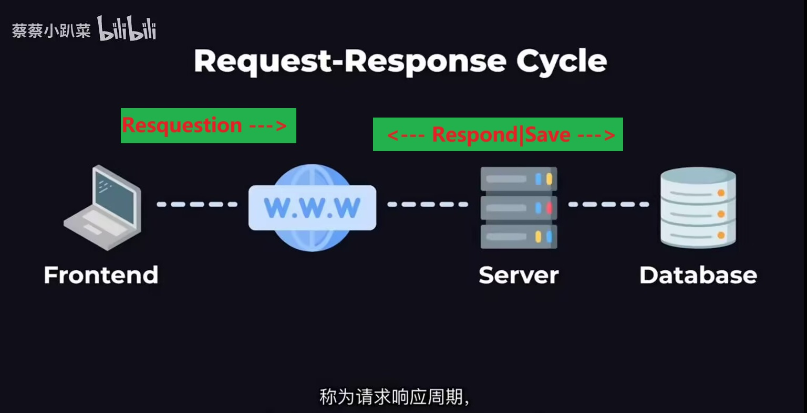

+++
date = '2025-11-29T01:21:04+08:00'
draft = false
weight = -99
title = '前端、后端和数据库之间的暧昧关系'
description = '简单阐述他们彼此之间在工作时的行为方式，侧重在后端'
+++

## 大体关系与逻辑


## 总逻辑
***客户端*** ---><sup>(Resquestion)</sup> 消息发送给***服务器*** -Internet- 保存之后给***客户端***发消息<sup>(Response)</sup><--- ***服务器*** ---><sup>(Save)</sup> 接受到消息之后保存到***数据库*** --->  ***数据库***

***
### 前端(Frontend)      
***客户端*** ,运行在用户的设备上，与用户交互。请求服务  
***前端*** , *客户端* 的页面和交互逻辑，是 *客户端* 的重要组成。   
* 请求：
```java  
Post        https: //yuming.com/ orders`
(请求类型)  (协议)  (域名)        (URL路径)
<!-- *域名：公司购买后进行配置 -> 帮助到达//域名 的消息找到对应的服务器 
*请求类型和*URL路径：识别请求的类型-->
```

*** 
### 后端
***服务器*** ，提供服务。  
***后端语言*** ， 运行在 *服务器* 上,实现服务器 **接收消息/处理逻辑/返回响应** 的功能。  
* 后端工具：  
1. Backend Framework:后端框架用于减少代码量  
2. Package manager:安装并管理包<sup>其他人写的代码工具</sup>
* 后端设计：
1. API:语法，对接收的请求设置哪些能接收，不能的将返回错误
##### 后端的运行：
<span style="color:red">现在很多公司都是通过<span style="color: black;font-weight:800">*云计算</span>来实现后端代码的运行</span>
1. 向云计算公司 租用 一堆计算机<sup>本质是一台机子的一部分，即存在于云计算公司软件</sup> ，称之为“虚拟机<sup>vm</sup>”***————基础设备即服务***  
2. 用vm虚拟机来运行后端
* 负载运行时的处理措施：  
> 用一台特殊的虚拟机，运行“负载均衡器”<sup>均分请求给服务器</sup>
* 微服务设计：  
> 把超级多的代码量分成多个代码库，具有独立的 -负载均衡器- -后端<sup>语言可以不同</sup>服务器- -数据库<sup>可以不同</sup>-
> 彼此之间发送请求来协同工作  
> ***实现代码库更加的小、集中***  
> **市场上已经有了很多能实现小型功能的微服务：**   
    1. 供开发者使用以实现某种微服务 ***————平台即服务***  

<span style="color:red">云计算的三大基础：基础设备即服务|平台即服务|直接给用户使用的完整的成熟的软件 ***————软件即服务***</span>


***
### 数据库
1. 用vm虚拟机运行

